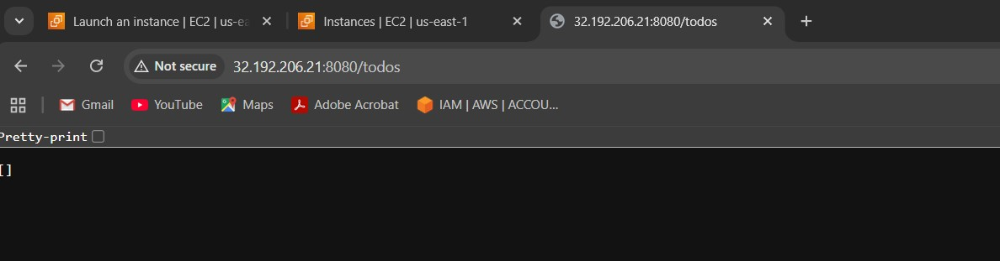
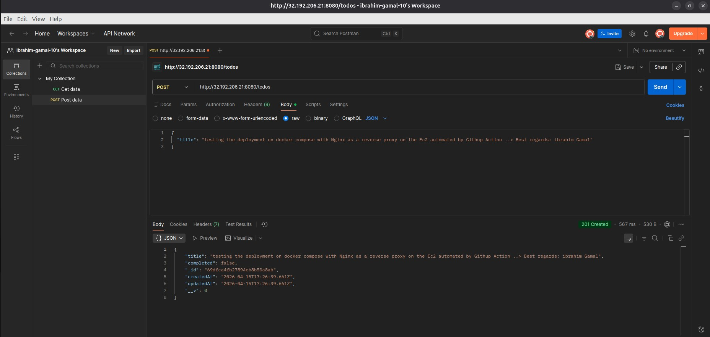
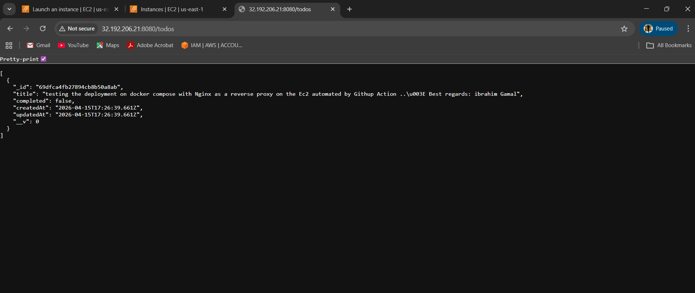
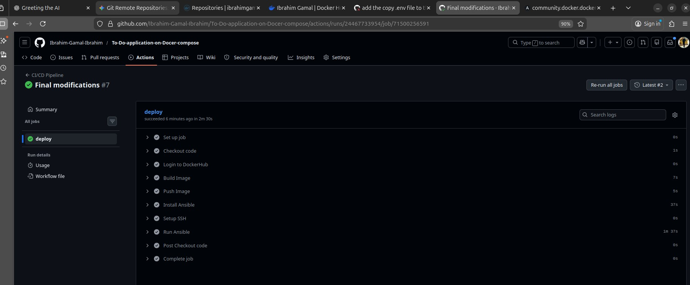

# 🚀 CI/CD Pipeline for a Dockerized Node.js Todo Application

## 📌 Project Overview

This project demonstrates a **production-style deployment pipeline** for a containerized Node.js application using modern DevOps practices.

The application is a simple **Todo API** built with:

* Node.js (Express)
* MongoDB (Mongoose)

The focus of this project is not just the application itself, but the **end-to-end DevOps lifecycle**, including:

* Containerization using Docker
* Multi-container orchestration using Docker Compose
* Reverse proxy setup using Nginx
* Infrastructure configuration using Ansible
* CI/CD automation using GitHub Actions
* Deployment to a remote EC2 server

---

## 🏗️ Architecture

```
Client (Browser / Postman)
        ↓
     Nginx (Reverse Proxy)
        ↓
   Node.js API (Docker Container)
        ↓
     MongoDB (Docker Container)
```

### 🔹 Key Concepts Applied

* Reverse Proxy Pattern (Nginx)
* Container Networking (Docker DNS)
* Infrastructure as Code (Ansible)
* CI/CD Automation (GitHub Actions)
* Configuration Externalization (.env)

---

## ⚙️ Tech Stack

* **Backend:** Node.js, Express
* **Database:** MongoDB
* **Containerization:** Docker, Docker Compose
* **Reverse Proxy:** Nginx
* **Configuration Management:** Ansible
* **CI/CD:** GitHub Actions
* **Cloud Provider:** AWS EC2

---

## 📂 Project Structure

```
.
├── app/                    # Node.js application
├── nginx/                  # Nginx configuration
├── compose.yml             # Multi-container setup
├── .env                    # Environment variables
├── infra/
│   └── ansible/            # Ansible playbooks & roles
├── .github/workflows/      # CI/CD pipeline
```

---

## 🐳 Step 1 — Dockerizing the Application

* Created a Dockerfile for the Node.js app
* Connected the app to MongoDB using environment variables
* Ensured data persistence using Docker volumes

---

## 🔗 Step 2 — Docker Compose Setup

* Defined multi-container architecture:

  * App container
  * MongoDB container
* Configured internal networking using service names
* Ensured MongoDB data persistence

---

## 🌐 Step 3 — Nginx Reverse Proxy

* Added Nginx as the public entry point
* Configured reverse proxy to route traffic to the app
* Removed direct exposure of the application container

### Result:

```
Before: Client → App
After:  Client → Nginx → App
```

---

## ☁️ Step 4 — Remote Server Setup

* Provisioned an EC2 instance
* Used Ansible to:

  * Install Docker & Docker Compose
  * Copy configuration files
  * Deploy containers

---

## 🔄 Step 5 — CI/CD Pipeline

Implemented a full CI/CD pipeline using GitHub Actions:

### Pipeline Flow:

1. Build Docker image
2. Push image to Docker Hub
3. Run Ansible playbook
4. Deploy application on EC2

---

## 🔐 Step 6 — Configuration Management

* Moved sensitive and dynamic values to `.env`
* Prevented secrets from being hardcoded
* Added `.env` to `.gitignore`

---

## 🧪 Testing & Validation

### 🔹 1. Initial State (No Data)

📸 

* GET `/todos` returns empty array

---

### 🔹 2. Insert Data via Postman

📸 

* POST `/todos` with JSON body

---

### 🔹 3. Data Retrieval

📸 

* GET `/todos` returns inserted data

---

### 🔹 4. CI/CD Pipeline Execution

📸 

* Successful pipeline run on GitHub Actions

---

## ⚠️ Challenges Faced

This project involved several real-world issues:

### ❌ MongoDB Connection Errors

* Fixed incorrect connection string format
* Learned difference between `localhost` and container networking

---

### ❌ Nginx Gateway Timeout

* Root cause: Node.js binding to `localhost`
* Fixed by using:

```js
app.listen(PORT, "0.0.0.0")
```

---

### ❌ Docker Networking Issues

* Learned that containers communicate via service names, not IPs

---

### ❌ CI/CD Deployment Failures

* Realized that `docker-compose.yml` must exist on the server
* Solved using Ansible file copy tasks

---

### ❌ Image Not Updating

* Learned that Docker does NOT auto-pull updated images
* Fixed using:

```
docker compose pull
```

or Ansible `pull: always`

---

## 📚 Key Learnings

This project significantly improved my understanding of:

* 🔹 Docker container lifecycle
* 🔹 Multi-container architecture
* 🔹 Reverse proxy design patterns
* 🔹 Infrastructure as Code (Ansible)
* 🔹 CI/CD pipeline design
* 🔹 Debugging distributed systems
* 🔹 Environment configuration best practices

---

## 🚀 What Makes This Project Special

This is not just a CRUD app.

It demonstrates:

✔ End-to-end DevOps workflow
✔ Real production-like deployment
✔ Automation without manual steps
✔ Proper separation of concerns

---

## 🔮 Future Improvements

* Add HTTPS using Let's Encrypt
* Implement image versioning (avoid `latest`)
* Add health checks & monitoring
* Introduce Terraform for full infrastructure provisioning
* Implement zero-downtime deployment

---

## 🙌 Final Thoughts

This project was a deep hands-on journey into DevOps practices.
It required debugging across multiple layers:

* Application
* Containers
* Networking
* CI/CD
* Remote infrastructure

Each issue solved contributed to a stronger understanding of how modern systems are built and deployed.

---

## 📬 Contact

**Ibrahim Gamal Ibrahim**
DevOps Engineer

---
